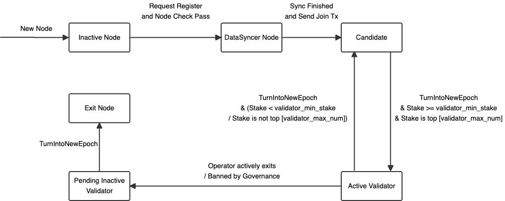
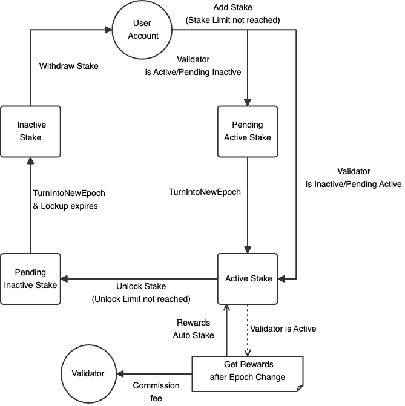

# Stake模块
Axiom-Ledger引入POS后的Stake模块，包含以下特点：
1. 委托质押池: 节点可以创建质押池成为候选节点(当池子的总质押数满足)，普通用户可以委托质押自己的代币给指定的质押池获取LST(ERC721代币，LiquidStakingToken)，并按照质押比例分得质押奖励。
2. 节点抽水委托质押者的奖励：验证者奖励每个epoch进行分发，并按照节点配置的比例抽水（抽水也会自动添加到质押池中进行复利）。
3. 节点退出队列：每个epoch的节点退出是有上限的，每个epoch重置。
4. 每个epoch添加和解锁的代币数量是有上限的，每个epoch重置
5. 最低和最高质押限制：每个质押池的总代币有上限，质押池代币需要满足下限才有可能成为验证者节点。
6. 质押奖励包含两部分：质押通胀奖励和节点出块的gas fee收益。
7. 复利：奖励自动添加入池子进行质押(不受质押池上限的限制)。
8. 共识惩罚异常节点的后续一段时间收益。
9. 节点状态/stake代币状态的变更都是需要延迟一个epoch。
10. 治理委员会有权利踢出验证者(保证网络安全性)。
11. 取消质押后的提款有锁定期：必须先进行unlock，等锁定期过了再withdraw。
12. 单笔委托质押有最低限制。
13. 单个nft同时存在的Unlocking记录有限制。

## 1. Genesis配置
Genesis配置需要配置创世节点stake的数量，并指定节点的角色，注意创世节点的stake数量需要满足配置的stake下限才可能成为验证者节点。
```toml
[[nodes]]
consensus_pubkey = '0xac9bb2675ab6b60b1c6d3ed60e95bdabb16517525458d8d50fa1065014184823556b0bd97922fab8c688788006e8b1030cd506d19101522e203769348ea10d21780e5c26a5c03c0cfcb8de23c7cf16d4d384140613bb953d446a26488fbaf6e0'
p2p_pubkey = '0xd4c0ac1567bcb2c855bb1692c09ab2a2e2c84c45376592674530ce95f1fda351'
operator_address = '0xc7F999b83Af6DF9e67d0a37Ee7e900bF38b3D013'
is_data_syncer = false
# (e.g. 10000000axc; 1000gmol; 1000mol; 1000)
stake_number = '10000000axc'
commission_rate = 0

[nodes.metadata]
  name = 'node1'
  desc = 'node1'
  image_url = ''
  website_url = ''

[[nodes]]
consensus_pubkey = '0xa41eb8e086872835b17e323dadd569d98caa8645b694c5a3095a1a0790a4390cb0db7a79af5411328bc17c9fb213d7f407a471c929e8aa2fe33e9e1472adb000c86990dd81078906d2cccd831a7fa4a0772a094e02d58db361162e95ac5e29fa'
p2p_pubkey = '0xeec45cda21da07acb89d3e7db8ce78933773b4b1daf567c2efddc6d5fd687001'
operator_address = '0x79a1215469FaB6f9c63c1816b45183AD3624bE34'
is_data_syncer = false
stake_number = '10000000axc'
commission_rate = 0

[nodes.metadata]
  name = 'node2'
  desc = 'node2'
  image_url = ''
  website_url = ''
```
如上面配置所示，每个节点需要配置共识使用的bls12381公钥，p2p使用的ed25519公钥，以及operator的地址（operator拥有控制节点的权限，也拥有从验证者池中提取抽水的收益的权利，可更新），以及节点的元信息(所有节点的name不能重复)，以及节点的角色(如果is_data_syncer是true，则stake_number必须是0，DataSyncer节点不会创建质押池)。生成第一个创世节点时，会按照配置初始化各节点，并选出第一个epoch的验证者节点列表(必须是满足质押下限，并选出质押数量的Top epoch_info.consensus_params.max_validator_num，如果选出的数量小于epoch_info.consensus_params.min_validator_num则会直接panic)

关键配置
```toml
[epoch_info]
  [epoch_info.stake_params]
    # 是否开启stake模块(当前不支持关闭，该配置暂时无效)
    stake_enable = true
    # 每个epoch最多能添加的代币数量的比例(每个epoch添加stake数量上限：max_add_stake_ratio/10000 * 上一个epoch总ActiveStake)
    max_add_stake_ratio = 1000
    # 每个epoch最多能解锁的代币数量的比例(每个epoch解锁stake数量上限：max_unlock_stake_ratio/10000 * 上一个epoch总ActiveStake)
    max_unlock_stake_ratio = 1000
    # 每个lst代币最多可以同时存在的解锁记录数量
    max_unlocking_record_num = 5
    # 代币解锁的锁定期(单位是秒，默认3天)
    unlock_period = 259200
    # 每个epoch最多能exit的验证者节点的数量比例(每个epoch验证者节点exit数量上限：max_pending_inactive_validator_ratio/10000 * 当前epoch总ActiveValidator数量，向下取整)
    max_pending_inactive_validator_ratio = 1000
    # 委托质押的最低stake数量
    min_delegate_stake = '100axc'
    # 成为validator所需的质押池的最低stake数量
    min_validator_stake = '10000000axc'
    # 质押池的的stake上限
    max_validator_stake = '50000000axc'
```

## 2. 节点管理
节点的状态模型如下图所示：



节点管理的涉及到的合约如下(地址: 0x0000000000000000000000000000000000001007)：
```solidity
// SPDX-License-Identifier: UNLICENSED

pragma solidity ^0.8.20;

   enum Status {
      DataSyncer,       // 0
      Candidate,        // 1
      Active,           // 2
      PendingInactive,  // 3
      Exited            // 4
   }

   struct NodeMetaData {
      string name;
      string desc;
      string imageURL;
      string websiteURL;
   }

   struct NodeInfo {
      uint64 ID;
      string ConsensusPubKey;
      string P2PPubKey;
      string P2PID;
      address Operator;
      NodeMetaData MetaData;
      Status Status;
   }

   struct ConsensusVotingPower {
      uint64 NodeID;
      int64 ConsensusVotingPower;
   }

interface NodeManager {
   error IncorrectStatus(uint8 status);
   error PendingInactiveSetIsFull();

   event Register(uint64 indexed nodeID, NodeInfo info);
   event JoinedCandidateSet(uint64 indexed nodeID, uint64 commissionRate);
   event Exit(uint64 indexed nodeID);
   event UpdateMetaData(uint64 indexed nodeID, NodeMetaData metaData);
   event UpdateOperator(uint64 indexed nodeID, address newOperator);

   function joinCandidateSet(uint64 nodeID, uint64 commissionRate) external;

   function exit(uint64 nodeID) external;

   function updateMetaData(uint64 nodeID, NodeMetaData memory metaData) external;

   function updateOperator(uint64 nodeID, address newOperator) external;

   function getInfo(uint64 nodeID) external view returns (NodeInfo memory info);

   function getTotalCount() external view returns (uint64);

   function getInfos(uint64[] memory nodeIDs) external view returns (NodeInfo[] memory info);

   function getActiveValidatorSet() external view returns (NodeInfo[] memory info, ConsensusVotingPower[] memory votingPowers);

   function getDataSyncerSet() external view returns (NodeInfo[] memory infos);

   function getCandidateSet() external view returns (NodeInfo[] memory infos);

   function getPendingInactiveSet() external view returns (NodeInfo[] memory infos);

   function getExitedSet() external view returns (NodeInfo[] memory infos);
}

```
以下操作以提供的命令行为例进行操作，也可以自己单独调用系统合约

### 2.1 新节点加入
新节点加入后默认是数据节点的角色，没有质押池
1. 部署节点
下载部署包，解压进入到节点目录并执行./init.sh脚本生成配置文件，共识和p2p私钥，将其他节点的genesis配置文件拷贝过来覆盖

2. 发送register提案
进入节点目录执行以下命令，发送register的提案，注意使用的私钥会成为节点的operator，发送完交易后等待确认后会打印提案的id
```shell
./axiom-ledger node --rpc https://node1.rpc register \
--block-number 1000 \
--title 注册节点5 \
--desc 注册节点5 \
--node-name 节点5 \
--node-desc 节点5 \
--node-image-url https://axiomesh.io \
--node-website-url https://axiomesh.io \
--sender b6477143e17f889263044f6cf463dc37177ac4526c4c39a7a344198457024a2f
```
block-number: 提案的过期时间，不设置会自动设置为当前区块高度+epoch间隔区块  
title：提案的标题，不设置会自动设置为`register node[node-name]`  
desc：提案的描述，不设置会自动设置为`register node[node-name]: node-desc`  
node-name: 节点名称，不能和已有的重复(也不能和提案中的重复)  
node-desc: 节点描述，可为空  
node-image-url：节点图片的url，可为空  
node-website-url：节点官网的url，可为空  
sender: 发送交易的私钥，会默认成为节点的operator（不限制是治理委员会成员）  
rpc: 接收交易的节点的rpc（不要用本节点的，因为本节点的状态是落后的）


3. 治理委员会投票通过register提案
   进入节点目录执行以下命令，投票通过上一步的register提案，sender需要使用治理委员会成员的私钥
```shell
./axiom-ledger governance vote \
--proposal-id 1 \
--pass \
--sender b6477143e17f889263044f6cf463dc37177ac4526c4c39a7a344198457024a2f
```
proposal-id：提案的id  
pass：是否投通过票  
sender: 发送交易的私钥（必须是治理委员会成员）  

投票通过后，会自动注册节点信息到链上，并分配节点id(自增分配，从1开始)

### 2.2 数据节点创建质押池成为为候选者节点
创建的质押池id即是节点的id，创建质押池时会生成一个本金为0的LST代币用于存放之后的抽水收益，owner是当前质押池对应节点的operator  
进入节点目录执行以下命令
```shell
./axiom-ledger node join-candidate-set \
--node-id 5 \
--commission-rate 1000 \
--sender b6477143e17f889263044f6cf463dc37177ac4526c4c39a7a344198457024a2f
```
node-id：节点的id  
commission-rate：奖励的抽水比例(万分比，范围：0-10000)  
sender: 发送交易的私钥（必须是节点的operator）

### 2.2 节点配置更新
1. 更新节点的operator  
进入节点目录执行以下命令
```shell
./axiom-ledger node update-operator \
--node-id 5 \
--new-operator 0x8626f6940E2eb28930eFb4CeF49B2d1F2C9C1199 \
--sender b6477143e17f889263044f6cf463dc37177ac4526c4c39a7a344198457024a2f
```
node-id：节点的id  
new-operator：新的operator地址  
sender: 发送交易的私钥（必须是节点的operator）

2. 更新节点的元信息  
进入节点目录执行以下命令
```shell
./axiom-ledger node update-metadata \
--node-id 5 \
--new-name node777 \
--new-desc node777 \
--new-website-url node777 \
--new-image-url node777 \
--sender b6477143e17f889263044f6cf463dc37177ac4526c4c39a7a344198457024a2f
```
node-id：节点的id  
node-name: 新的节点名称，不能和已有的重复(为空则使用旧的)  
node-desc: 新的节点描述(为空则使用旧的)  
node-image-url：新的节点图片的url(为空则使用旧的)  
node-website-url：新的节点官网的url(为空则使用旧的)  
sender: 发送交易的私钥（必须是节点的operator）

### 2.3 节点退出
如果是候选者节点/验证者节点退出，则会关闭质押池(不能添加质押)，如果是验证者节点退出后，不能立马关闭节点，需要等到下一个epoch生效后再关闭节点，如果是候选者节点，则可以直接关闭节点

进入节点目录执行以下命令
```shell
./axiom-ledger node exit \
--node-id 5 \
--sender b6477143e17f889263044f6cf463dc37177ac4526c4c39a7a344198457024a2f
```
node-id：节点的id  
sender: 发送交易的私钥（必须是节点的operator）

## 3. 委托质押
用户可以委托质押代币给质押池，并从中获取一定的收益，质押代币的状态模型如下图所示：



质押管理的涉及到的合约如下(地址: 0x0000000000000000000000000000000000001003)：
```solidity
// SPDX-License-Identifier: UNLICENSED

pragma solidity ^0.8.20;

   struct LiquidStakingTokenRate {
      uint256 StakeAmount;
      uint256 LiquidStakingTokenAmount;
   }

   struct PoolInfo {
      uint64 ID;
      bool IsActive;
      uint256 ActiveStake;
      uint256 TotalLiquidStakingToken;
      uint256 PendingActiveStake;
      uint256 PendingInactiveStake;
      uint256 PendingInactiveLiquidStakingTokenAmount;
      uint64 CommissionRate;
      uint64 NextEpochCommissionRate;
      uint256 LastEpochReward;
      uint256 LastEpochCommission;
      uint256 CumulativeReward;
      uint256 CumulativeCommission;
      uint256 OperatorLiquidStakingTokenID;
   }

interface StakingManager {
   event AddStake(uint64 indexed poolID, address indexed owner, uint256 amount, uint256 liquidStakingTokenID);

   event Unlock(uint256 liquidStakingTokenID, uint256 amount, uint64 unlockTimestamp);

   event Withdraw(uint256 liquidStakingTokenID, address indexed recipient, uint256 amount);

   function addStake(uint64 poolID, address owner, uint256 amount) external payable;

   function unlock(uint256 liquidStakingTokenID, uint256 amount) external;

   function withdraw(uint256 liquidStakingTokenID, address recipient, uint256 amount) external;

   function batchUnlock(uint256[] memory liquidStakingTokenIDs, uint256[] memory amounts) external;

   function batchWithdraw(uint256[] memory liquidStakingTokenIDs, address recipient, uint256[] memory amounts) external;

   function getPoolInfo(uint64 poolID) external view returns (PoolInfo memory poolInfo);

   function getPoolHistoryLiquidStakingTokenRate(uint64 poolID, uint64 epoch) external view returns (LiquidStakingTokenRate memory poolHistoryLiquidStakingTokenRate);
}
```
LST合约如下(地址: 0x0000000000000000000000000000000000001004)：
```solidity
pragma solidity >=0.7.0 <0.9.0;

    struct UnlockingRecord {
        uint256 Amount;
        uint64 UnlockTimestamp;
    }

    struct LiquidStakingTokenInfo {
        uint64 PoolID;
        uint256 Principal;
        uint256 Unlocked;
        uint64 ActiveEpoch;
        UnlockingRecord[] UnlockingRecords;
    }

// compatible with ERC721
interface LiquidStakingToken {
    // ERC721

    event Transfer(address indexed _from, address indexed _to, uint256 indexed _tokenId);
    event Approval(address indexed _owner, address indexed _approved, uint256 indexed _tokenId);
    event ApprovalForAll(address indexed _owner, address indexed _operator, bool _approved);
    event UpdateInfo(uint256 indexed _tokenId, uint256 _newPrincipal, uint256 _newUnlocked, uint64 _newActiveEpoch);

    function balanceOf(address _owner) external view returns (uint256);

    function ownerOf(uint256 _tokenId) external view returns (address);

    function safeTransferFrom(address _from, address _to, uint256 _tokenId, bytes calldata data) external payable;

    function safeTransferFrom(address _from, address _to, uint256 _tokenId) external payable;

    function transferFrom(address _from, address _to, uint256 _tokenId) external payable;

    function approve(address _to, uint256 _tokenId) external payable;

    function setApprovalForAll(address _operator, bool _approved) external;

    function getApproved(uint256 _tokenId) external view returns (address);

    function isApprovedForAll(address _owner, address _operator) external view returns (bool);

    // liquid staking token specific methods

    function getInfo(uint256 _tokenId) external view returns (LiquidStakingTokenInfo memory info);

    function getLockedReward(uint256 _tokenId) external view returns (uint256);

    function getUnlockingCoin(uint256 _tokenId) external view returns (uint256);

    function getUnlockedCoin(uint256 _tokenId) external view returns (uint256);

    function getLockedCoin(uint256 _tokenId) external view returns (uint256);

    function getTotalCoin(uint256 _tokenId) external view returns (uint256);
}
```
以下操作以提供的命令行为例进行操作，也可以自己单独调用系统合约

### 3.1 添加质押代币
普通用户可以委托质押代币给指定的质押池(不能是已关闭的)，等到下一个epoch开始进行锁定并获取收益。委托质押后会生成一个LST代币(ERC721代币，LiquidStakingToken)，这个代币的所有者拥有质押的本金和收益，也可以进行买卖转移

进入节点目录执行以下命令，发送完交易后等待确认后会打印LST代币的id
```shell
./axiom-ledger staking add-stake \
--pool-id 5 \
--amount 100axc \
--owner 5 \
--sender b6477143e17f889263044f6cf463dc37177ac4526c4c39a7a344198457024a2f
```
pool-id：质押池的id(也是节点id)
amount：质押的代币的金额(e.g. 10000000axc; 1000gmol; 1000mol; 1000)
owner：生成的LST代币的所有者(不设置的话默认是sender自己)
sender: 发送交易的私钥（只需要有足够代币即可）

### 3.2 解锁质押代币
当代币被锁定获取收益时，用户不能直接提款，而是需要进行解锁操作，等待锁定期到了之后才能提款（注意如果刚AddStake还未进入到下一个epoch前，这时候的代币状态是未锁定的，不需要解锁操作，直接提款即可）。如果执行的是部分解锁，那么剩余的资金会自动质押从下一个epoch开始生效(本金更新为剩余的资金，收益重置为0)，同时当前epoch不会获得收益(这部分收益被其他staker分掉了)

进入节点目录执行以下命令
```shell
./axiom-ledger staking unlock-stake \
--lst-id 5 \
--amount 100axc \
--sender b6477143e17f889263044f6cf463dc37177ac4526c4c39a7a344198457024a2f
```
lst-id：LST的id
amount：要解锁的代币的金额(e.g. 10000000axc; 1000gmol; 1000mol; 1000，支持部分解锁，最大值为本金+累计锁定的收益)
sender: 发送交易的私钥（必须是LST的owner）

### 3.3 提款已解锁代币
从lst代币中提取已解锁的代币

进入节点目录执行以下命令
```shell
./axiom-ledger staking withdraw \
--lst-id 5 \
--amount 100axc \
--recipient
--sender b6477143e17f889263044f6cf463dc37177ac4526c4c39a7a344198457024a2f
```
lst-id：LST的id
amount：要解锁的代币的金额(e.g. 10000000axc; 1000gmol; 1000mol; 1000，最大为已解锁的代币数量)
recipient：提取代币的接受者
sender: 发送交易的私钥（必须是LST的owner）

### 3.4 查看LST信息
1. 查看本金
进入节点目录执行以下命令
```shell
./axiom-ledger staking-lst info \
--lst-id 5
```
输出的Principal即为本金

2. 查看锁定的利润
进入节点目录执行以下命令
```shell
./axiom-ledger staking-lst locked-reward \
--lst-id 5
```

3. 查看解锁中的代币数量
   进入节点目录执行以下命令
```shell
./axiom-ledger staking-lst unlocking-coin \
--lst-id 5
```

4. 查看已解锁的代币数量
   进入节点目录执行以下命令
```shell
./axiom-ledger staking-lst unlocked-coin \
--lst-id 5
```

5. 查看总的代币数量
   进入节点目录执行以下命令
```shell
./axiom-ledger staking-lst total-coin \
--lst-id 5
```

### 3.5 查看operator的抽水信息
执行以下命令查看质押池存放抽水收益的LST ID
```shell
./axiom-ledger staking pool-info \
--node-id 5
```
输出的OperatorLiquidStakingTokenID即是

再执行上述查看总的代币数量命令查看抽水奖励（抽水奖励也会加入到下一个epoch的质押中进行复利，如果是创世节点的质押池，这里还包括了节点创世质押的代币数量）

## 4. 奖励分发
epoch中每个成为验证者的节点对应的质押池会获取到整个epoch的收益，收益包含通胀产生的，以及区块中的gas fee，以epoch为单位进行结算。总的reward会被抽水，然后累计到质押池的抽水LST中，剩下的奖励按照质押代币数量分到所有委托质押者的lst中。 注意由于实现起来都是用u256进行计算，会有一定的精度损失，所有质押者的锁定代币数量之和 <= 质押池的锁定代币数量，但是误差不会太大

举一个实际的例子以便于理解：
质押池创世的代币数量是10000，抽水比例是40%
### epoch 1:
epoch期间操作:  
无  

epoch结束的TotalReward: 10000  
Commission: 4000  
StakerReward: 6000  

epoch变更前后ActiveStake代币数量：  
[pool] before: 10000, after: 20000  
[operator] before: 10000, after: 20000  

这里 20000 = 10000 + 6000 * 10000/10000 + 4000  
也就是 之前的ActiveStake + Commission + StakerReward * 之前operator的ActiveStake/ 之前pool的ActiveStake 

### epoch 2:
epoch期间操作:  
userA add stake: 30000  

epoch结束的TotalReward: 10000  
Commission: 4000  
StakerReward: 6000  

epoch变更前后ActiveStake代币数量：  
[pool] before: 20000, after: 60000 = 20000 + 10000 + 30000  
[operator] before: 20000, after: 30000  = 20000 + 6000 * 20000/20000 + 4000  
[userA] before: 30000, after: 30000

### epoch 3:
epoch期间操作:  
userB add stake: 30000

epoch结束的TotalReward: 10000  
Commission: 4000  
StakerReward: 6000  

epoch变更前后ActiveStake代币数量：  
[pool] before: 60000, after: 100000 = 60000 + 10000 + 30000  
[operator] before: 30000, after: 37000  = 30000 + 6000 * 30000/60000 + 4000  
[userA] before: 30000, after: 33000  = 30000 + 6000 * 30000/60000  
[userB] before: 30000, after: 30000  

### epoch 4:
epoch期间操作:  
无

epoch结束的TotalReward: 10000  
Commission: 4000  
StakerReward: 6000

epoch变更前后ActiveStake代币数量：  
[pool] before: 100000, after: 110000 = 100000 + 10000  
[operator] before: 37000, after: 43220  = 37000  + 6000 * 37000/100000+ 4000  
[userA] before: 33000, after: 34980  = 33000 + 6000 * 33000/100000  
[userB] before: 30000, after: 31800 = 30000 + 6000 * 30000/100000  

### epoch 5:
epoch期间操作:  
userA unlock stake = 20000  
userC add stake = 30000

epoch结束的TotalReward: 20000  
Commission: 8000  
StakerReward: 12000

epoch变更前后ActiveStake代币数量：  
[pool] before: 110000, after: 140000 = 110000 - 20000 + 30000 + 20000  
[operator] before: 43220, after: 58133 = 43220 + 12000 * 43220/(110000-34980) + 8000  
[userA] before: 34980, after: 14980 = 34980 - 20000  
[userB] before: 31800, after: 36886 = 31800 + 12000 * 31800/(110000-34980)  
[userC] before: 30000, after: 30000   

userA解锁，导致未获得该epoch的收益，且剩余的资金在下一个epoch生效

### epoch 6:
epoch期间操作:  
operator unlock stake = 10000  

epoch结束的TotalReward: 20000  
Commission: 8000  
StakerReward: 12000

epoch变更前后ActiveStake代币数量：  
[pool] before: 140000, after: 150000 = 140000 + 20000 - 10000  
[operator] before: 58133, after: 56133 = 58133 - 10000 + 8000  
[userA] before: 14980, after: 17175 = 14980 + 12000 * 14980/(140000-58133)  
[userB] before: 36886, after: 42292 = 36886 + 12000 * 36886/(140000-58133)  
[userC] before: 30000, after: 34397 = 30000 + 12000 * 30000/(140000-58133)

operator解锁，导致未活动该epoch的stake收益，仅获得抽水奖励，且剩余的资金在下一个epoch生效
